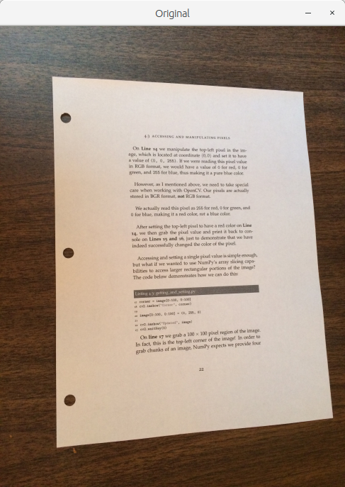
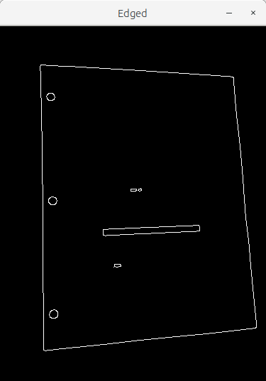
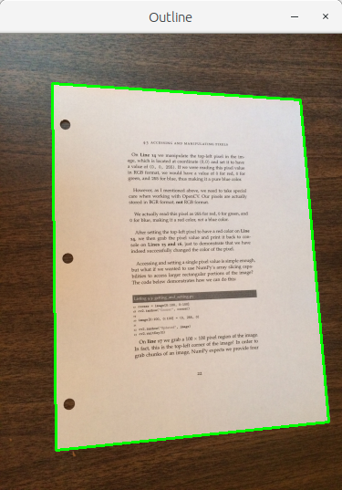
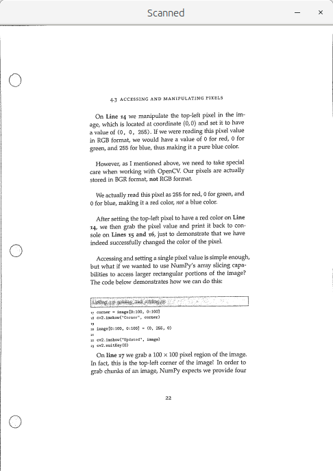

# :zap: [Py]Scanner :zap:

 
A Kick-Ass Document Scanner application using OpenCV written in python.

## Example:

### Original Image :

### Scanned Image :

## Dependancies

- Used Python Version: 2.7.0
- Install necessary modules with `pip2 install -r requirements.txt` command.

## How to run the scanner ?
Argument parser used for image is `--i` and `--image`. So to scan an image -->

`python2 scan.py --i <ImageFileName>`
 
`python2 scan.py --image <ImageFileName>`

## How it works ?

It works in just three simple steps:

- Step 1: Detect edges.
- Step 2: Use the edges in the image to find the contour (outline) representing the piece of paper being scanned.
- Step 3: Apply a perspective transform to obtain the top-down view of the document and thresholding to obtain a nice, clean black and white feel to the piece of paper.

- For example :
#### Original Image :

#### Step 1 : Edge detection :

#### Step 2 : Finding the outline :

#### Step 3 : Applying perspective transform and thresholding :

## Author

Mainak Pal ( @mpalrocks )
